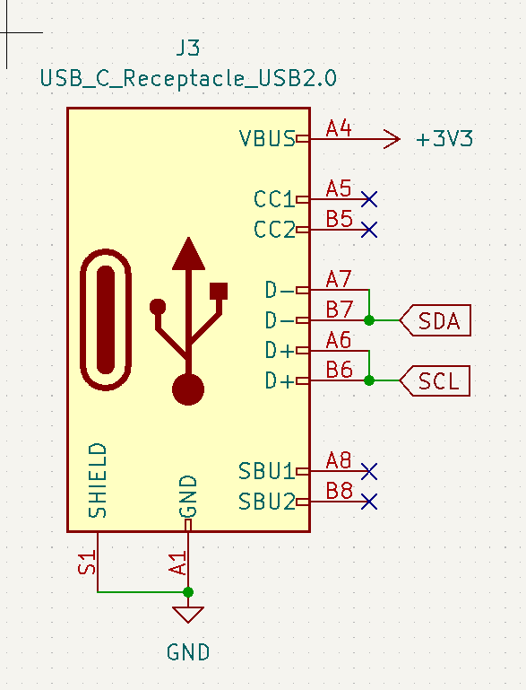
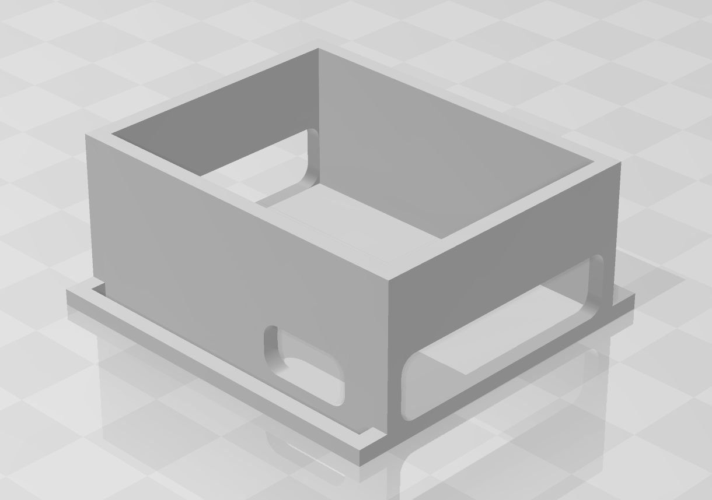

**Total time taken for all journeys: 11.5h**

# June 8th: Research & PCB

As someone who uses Oculus Quest 2 VR well, I wanted full tracking in VR (normally VR only recognizes the head and hands, but full tracking refers to recognizing the legs and other parts as well).

After searching for related infos, I came across an open source VR tracker called SlimeVR.

Search for related information (including some Korean communities)<br>
https://docs.slimevr.dev/diy/index.html<br>
https://gall.dcinside.com/mgallery/board/view/?id=vr&no=2551595<br>
https://gall.dcinside.com/mgallery/board/view/?id=vr&no=2565494<br>
https://arca.live/b/vrchat/86783267<br>
etc...

This gave me an idea for making a controller.

After researching these materials, I organized the following elements.


[Pic1] Someone else's prototype

First, I simply divided VR trackers into two types. The first is a method that recognizes a single tracker, and the second is a method in which the main tracker and sub tracker operate as a set.

However, in the second method of two trackers forming a set, I found that all the DIYs I looked at permanently fixed the cables connecting these trackers.

However, in this case, the cables are connected, making it difficult to store, and it is also difficult to repair if the cables are damaged.

That is why I designed a method to connect each tracker with a C to C cable so that it can be separated and stored when desired.

After that, before designing, I was worried about which recognition sensor to use.

This was because the performance of the tracker varied greatly depending on which sensor was used.

While looking for related materials, I came across a Slime VR Tracker circuit diagram site that had a ranking of each sensor, so I chose the sensors based on that.

https://docs.slimevr.dev/diy/tracker-schematics.html

```plain
 ICM-45686 - Very good and cheaper than LSM6DSV. Experimental
 LSM6DSV - Very good and slightly cheaper than BNO085
 LSM6DSR - decent and a little cheaper than ICM-45686 and LSM6DSV Experimental
 BNO085 - Great but expensive $$$. Not recomended.
 BNO085 (Adafruit) - Adafruit version of BNO085. Not recomended.
 BMI160 - Very cheap but not very good performance DO NOT USE!
 MPU6050 - Cheap but drifts quite a bit. DO NOT USE!
 MPU9250 (GY-91) - Not terrible but plagued with fakes. DO NOT USE!
 MPU6050 + QMC5883L - Experimental cheaper MPU9250 equivalent. DO NOT USE!
```

So I chose ICM-45686.


[Pic2] Reference circuit diagram

So based on this, I got the following circuit diagram and started working on it.

However, the following problems occurred during the work:

1. I could not find a suitable NTC when using the TP4056 chip
2. I wanted to use the module (link below) for using the ICM-45686, but the footprint was not provided.

url: https://store.kouno.xyz/products/icm-45686-qmc6309-module

Although the purchase page provided a schematic for the ICM-45686 module, I thought it would be better to mount the module itself on the PCB in SMD form.

I sent a related email through the inquiry email on the homepage to inquire about this.

After that, I decided to have the current work briefly reviewed on Hackclub Slack until the issue related to the ICM-45686 chip is resolved.


[Pic3] Hackclub Slack #highway

While waiting, I decided to do a CAD design because I felt time was short.

Before designing, I decided to specify the parts that would be difficult to design myself.

I divided the items like this:
- Strap
- Battery

The straps were chosen from the vendors recommended in the Slime VR guide.

https://ko.aliexpress.com/item/1005001908740631.html?gatewayAdapt=glo2kor

I decided on the size of my option as 38mm x ~~~mm.

I looked for the battery in a domestic shopping mall.

(At first, I looked for it in Aliexpress, but the price was cheaper and the delivery was faster in a domestic shopping mall, so I chose a domestic shopping mall.)<br>
(Aliexpress's min: 5,176 KRW, domestic shopping mall's min: 3,850 KRW, 1200mAh BAT)

So I chose this product.

http://icbanq.com/P012000307

Afterwards, I accepted the feedback I received, modified the circuit diagram, and completed the main tracker.


[Pic4] Main tracker schematic


[Pic5] Main tracker PCB

**Total time spent: 11.5h**

# June 9th: Sch / PCB Modification and Case work

I remembered that I forgot to add the power switch before I went to bed.

So I modified the schematic and PCB like this:


[Pic1] Main tracker schematic


[Pic2] Main tracker PCB

And to finalize the design of the sub tracker, I drew the connection between the two trackers as follows:


[Pic3] usb-c conn schematic

I have finished designing the sub tracker circuit.


[Pic4] Sub tracker schematic


[Pic5] Sub tracker PCB

After that, I also completed the case work for the PCB, battery, and strap.


[Pic6] Main tracker 3D model


[Pic7] Sub tracker 3D model

For the parts BOM, I used Kicad BOM export to create the list of parts used on the PCB, and wrote the other necessary items myself.

**Total time spent: 4.5h**