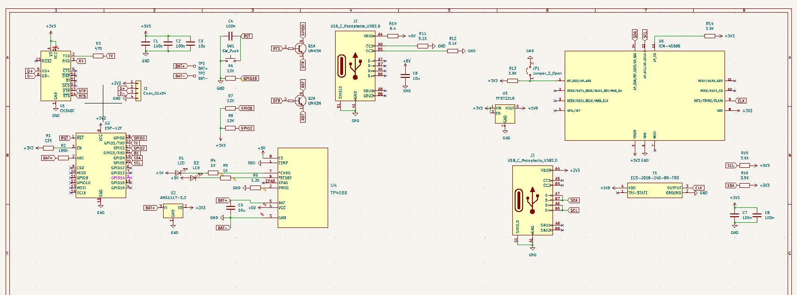
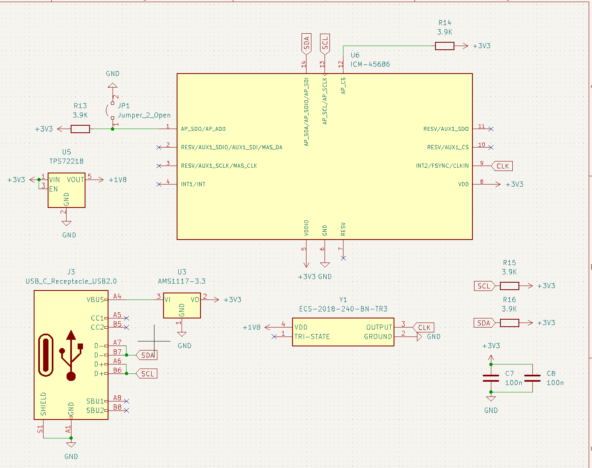
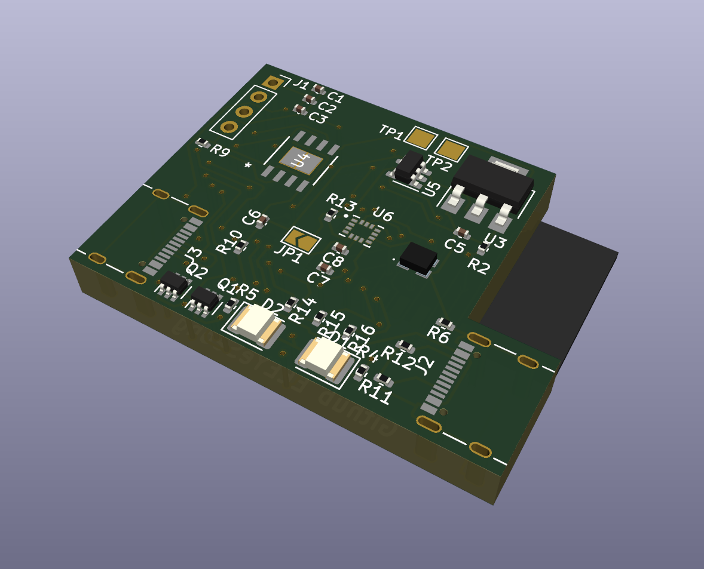
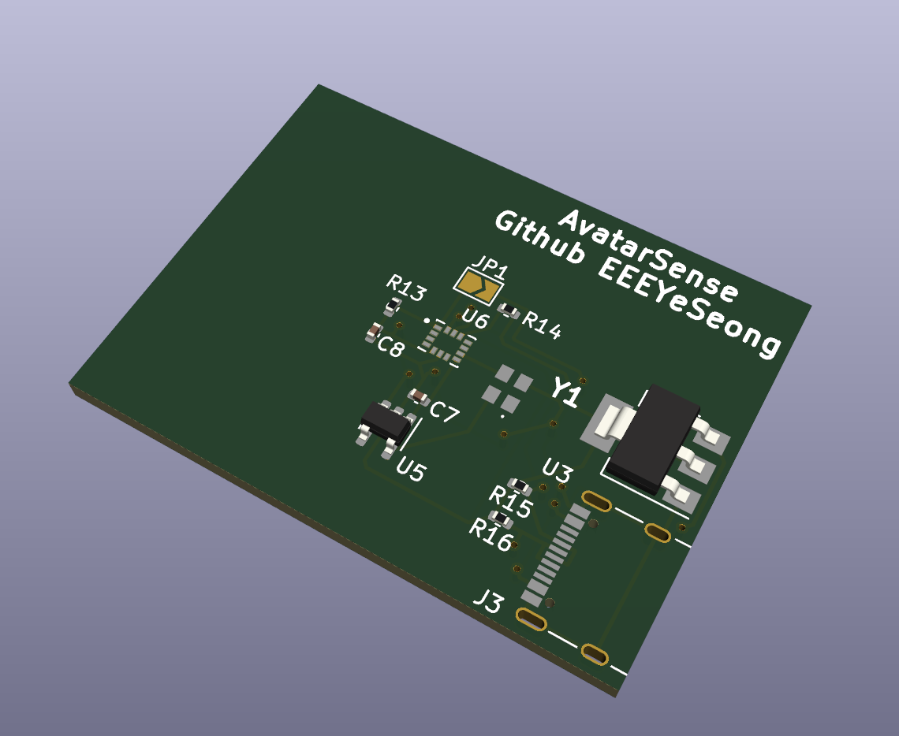
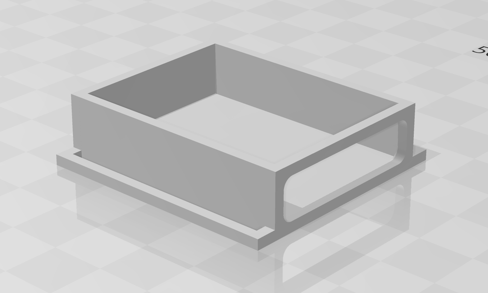

# AvatarSense

User-friendly VR tracking device based on Slime VR (but more compact!)

While using Oculus Quest 2, I felt the need for full-body tracking, so I started a project to create a tracker based on SlimeVR to implement it myself. In order to improve the inconvenience of existing DIY trackers, I designed the connection between trackers to be detachable with a USB-C to C cable for easy storage and maintenance. For the sensor, I chose ICM-45686 after considering performance and price by referring to the SlimeVR documentation, and designed the circuit diagram and PCB based on it. I modified and optimized the circuit based on feedback, and completed the case design with 3D modeling.

## Reason for starting the project

I started this project to try out full body tracking with Oculus Quest 2 because I was intrigued when I saw some people doing full body tracking.

## Reason Kicad project file is missing

Excluded due to licensing issues with the library used in the design
But here is the schematic PDF file!

https://github.com/EEEYeSeong/AvatarSense/blob/main/PCB/Schematics/MainTracker.pdf 
https://github.com/EEEYeSeong/AvatarSense/blob/main/PCB/Schematics/SubTracker.pdf

# BOM
|NO.|Item                             |Specification|Quantity|Unit Price (USD)|Amount (USD)|Site Address                                         |Note                                |
|---|---------------------------------|-------------|--------|----------------|------------|-----------------------------------------------------|------------------------------------|
|1  |100pcs SMD LED Kit               |1210-Kit     |1       |1.82            |1.82        |https://www.aliexpress.com/item/1005006417226949.html|                                    |
|2  |10Pcs USB Type C Female connector|M 16Pin      |3       |1.91            |5.73        |https://www.aliexpress.com/item/1005007419369264.html|                                    |
|3  |UMH3N                            |             |12      |0.194           |2.33        |https://www.digikey.kr/short/vwz73qcb                |                                    |
|4  |Slide switch                     |H 2.5MM      |1       |2.24            |2.24        |https://www.aliexpress.com/item/1005005531534722.html|                                    |
|5  |Push switch                      |             |0       |0               |0           |                                                     |DNP                                 |
|6  |CH340C                           |CH340C       |1       |4.22            |4.22        |https://www.aliexpress.com/item/1005005359696452.html|                                    |
|7  |ESP-12F                          |10pcs ESP12F |1       |12.55           |12.55       |https://www.aliexpress.com/item/1005007640911395.html|                                    |
|8  |AMS1117-3.3                      |             |1       |2.4             |2.4         |https://www.aliexpress.com/item/1005006127208470.html|                                    |
|9  |TP4056                           |             |10      |1.34            |13.4        |https://www.aliexpress.com/item/1005008508034871.html|                                    |
|10 |TPS72218                         |             |10      |1.028           |10.28       |https://www.digikey.kr/short/nz2j22dn                |                                    |
|11 |ICM-45686                        |             |10      |5.052           |50.52       |https://www.digikey.kr/short/zzb7mr3f                |                                    |
|12 |1521H-32K000J18DTSTK             |             |10      |0.904           |9.04        |https://www.digikey.kr/short/72mcdzz2                |                                    |
|13 |Main tracker & Sub tracker PCB   |             |15      |0.8             |12          |https://jlcpcb.com                                   |                                    |
|14 |Lipo battery                     |             |0       |0               |0           |                                                     |Plan to purchase with personal funds|
|15 |Rubber Band                      |35mm, 8 meter|1       |3.03            |3.03        |https://www.aliexpress.com/item/1005003092650651.html|                                    |
|16 |Shipping fees                    |             |1       |13.63           |13.63       |                                                     |Aliexpress($4.91) + JLCPCB($8.72)   |
